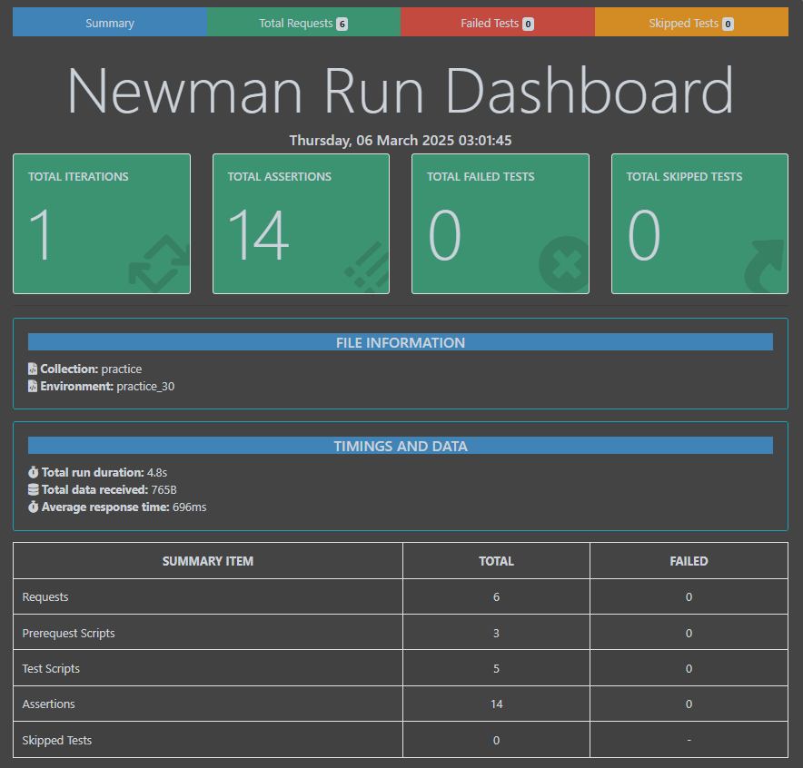
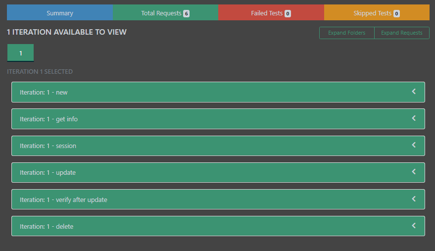
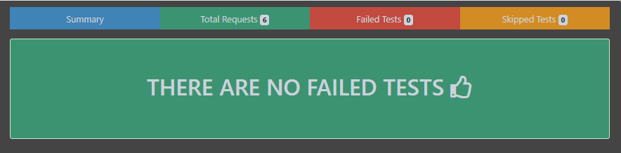
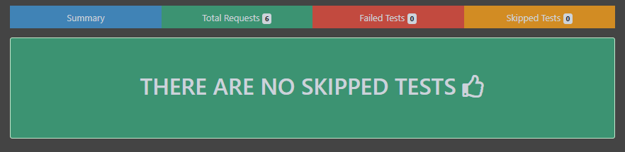

# Rest Booking API Testing with Postman Newman

This project demonstrates API testing using Postman, providing a collection of tests to validate various endpoints of the API.


## Features

- Tests for GET, POST, PUT, DELETE requests
- Collection of tests covering different API endpoints 
- Environment setup for easy switching between environments
- Pre-request scripts for data setup
- Test scripts for assertions and validations


## API Documentation
https://documenter.getpostman.com/view/9625258/SzS8tQrQ
## Technology used
- Postman
- Newman
## Prerequisite
- Node Js
- Newman
- Newman HTML Report Library

## Installation

1. Postman: If you haven't already,  https://www.postman.com/downloads/
2. Clone the repository


3. Import the Postman collection:
 - Open Postman.
 - Click on the Import button.
 - Select the file from the repository.

4. Import the Postman environment:
 - In Postman, click on the gear icon in the top right corner.
 - Select Import and choose the file.

5. Newman and Report Installation Process:
 - Newman Install Command: 
   `npm install -g newman`
 - Newman Html Report Install Command:  
   `npm install -g newman-reporter-htmlextra` 
## Usage

1. Select Environment:
 - In Postman, select the appropriate environment (e.g., Development, Production) from the top-right dropdown.
2. Run Collection:
 - Select the imported collection from the  Collections sidebar.
 - Click on the Runner button to open the collection runner.
 - Select the desired environment.
 - Click Start Test to run the collection.
3. View Results:
 - Once the tests are complete, view the results in the Runner tab.
 - Detailed test results can be viewed for each request.


# Testing

## Test Case Scenarios:

## 1. Create New Booking

Request URL: https://restful-booker.herokuapp.com/booking/

Request Method: POST

Pre-request Script:

```
let firstName = pm.variables.replaceIn("{{$randomFirstName}}")
console.log(firstName)
pm.environment.set("firstName",firstName)

let lastName = pm.variables.replaceIn("{{$randomLastName}}")
console.log(lastName)
pm.environment.set("lastName",lastName)

let totalPrice = pm.variables.replaceIn("{{$randomInt}}")
console.log(totalPrice)
pm.environment.set("totalPrice", totalPrice)

let depositPaid = pm.variables.replaceIn("{{$randomBoolean}}")
console.log(depositPaid)
pm.environment.set("depositPaid", depositPaid)

const moment = require('moment')
const today = moment()
var checkin = today.subtract(3,'d').format("YYYY-MM-DD")
console.log(checkin)
pm.environment.set("checkin", checkin)

const today1 = moment()
var checkout = today1.format("YYYY-MM-DD")
console.log(checkout)
pm.environment.set("checkout", checkout)
```

Request Body:

```
{
	"firstname" : "{{firstName}}",
	"lastname" : "{{lastName}}",
	"totalprice" : {{totalPrice}},
	"depositpaid" : {{depositPaid}},
	"bookingdates" : {
    	"checkin" : "{{checkin}}",
    	"checkout" : "{{checkout}}"
	},
	"additionalneeds" : "Breakfast"
}
```

Response Body:

```
{
    "bookingid": 4696,
    "booking": {
        "firstname": "Krystel",
        "lastname": "Walker",
        "totalprice": 327,
        "depositpaid": false,
        "bookingdates": {
            "checkin": "2025-03-03",
            "checkout": "2025-03-06"
        },
        "additionalneeds": "Breakfast"
    }
}
```

## 2. Get Booking Details By ID

Request URL: https://restful-booker.herokuapp.com/booking/bookingid

Request Method: Get

Response Body:

```
{
    "firstname": "Johnpaul",
    "lastname": "Cartwright",
    "totalprice": 613,
    "depositpaid": false,
    "bookingdates": {
        "checkin": "2025-03-03",
        "checkout": "2025-03-06"
    },
    "additionalneeds": "Breakfast"
}
```

## 3. Create A Token For Authentication.

Request URL: https://restful-booker.herokuapp.com/auth

Request Method: POST

Pre-request Script: None

Request Body:

```
{
   "username": "admin",
   "password": "password123"
}
```

Response Body:
```
{
   "token": "d3535ea05cb7ce0"
}
```

## 4. Update the Booking Details

Request URL: https://restful-booker.herokuapp.com/booking/bookingid

Request Method: PUT

Pre-request Script:

```
let updated_firstName = pm.variables.replaceIn("{{$randomFirstName}}")
console.log(updated_firstName)
pm.environment.set("updated_firstName",updated_firstName)

let updated_lastName = pm.variables.replaceIn("{{$randomLastName}}")
console.log(updated_lastName)
pm.environment.set("updated_lastName",updated_lastName)

let updated_totalPrice = pm.variables.replaceIn("{{$randomInt}}")
console.log(updated_totalPrice)
pm.environment.set("updated_totalPrice", updated_totalPrice)

let updated_depositPaid = pm.variables.replaceIn("{{$randomBoolean}}")
console.log(updated_depositPaid)
pm.environment.set("updated_depositPaid", updated_depositPaid)

const moment = require('moment')
const today = moment()
var updated_checkin = today.subtract(3,'d').format("YYYY-MM-DD")
console.log(updated_checkin)
pm.environment.set("updated_checkin", updated_checkin)

const today1 = moment()
var updated_checkout = today1.format("YYYY-MM-DD")
console.log(updated_checkout)
pm.environment.set("updated_checkout", updated_checkout)
```

Request Body:

```
{
	"firstname" : "{{updated_firstName}}",
	"lastname" : "{{updated_lastName}}",
	"totalprice" : {{updated_totalPrice}},
	"depositpaid" : {{updated_depositPaid}},
	"bookingdates" : {
    	"checkin" : "{{updated_checkin}}",
    	"checkout" : "{{updated_checkout}}"
	},
	"additionalneeds" : "Breakfast"
}
```
Response Body:
```
{
    "firstname": "Sadie",
    "lastname": "Schultz",
    "totalprice": 457,
    "depositpaid": true,
    "bookingdates": {
        "checkin": "2025-03-03",
        "checkout": "2025-03-06"
    },
    "additionalneeds": "Breakfast"
}
```

## 5. Delete Booking Record

Request URL: https://restful-booker.herokuapp.com/booking/bookingid

Request Method: DELETE

Response Body: None

# Run Command:

Run Command for Console:

    newman run practice.postman_collection.json -e practice_30.postman_environment.json

Run Command for Report:
    
    newman run practice.postman_collection.json -e practice_30.postman_environment.json -r cli,htmlextra
## Newman Report Summary:







